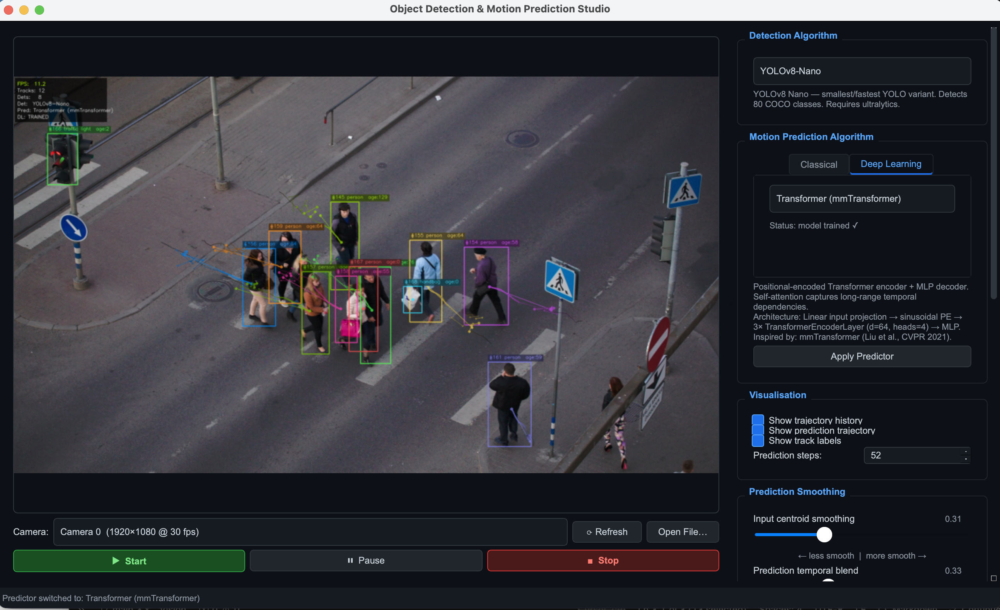

# Vision Studio

Real-time **path detector and path predictor** built with PyQt6 + OpenCV + PyTorch.

The app detects moving objects, tracks each object's path over time, and predicts where each path is heading next.



## What It Does

- **Path Detection:** detects objects in video frames
- **Path Tracking:** links detections into stable IDs and trajectory history
- **Path Prediction:** forecasts future trajectory points per tracked object
- **Live UI Controls:** switch algorithms, filter object size, tune smoothing

## Core Features

### Detection Algorithms
- Background Subtraction (MOG2, KNN)
- Optical Flow (Farneback)
- HOG + SVM (pedestrian)
- Haar Cascade (face/body)
- YOLOv8 (nano/small/medium)

### Prediction Algorithms

**Classical**
- Kalman Filter
- Constant Velocity
- Constant Acceleration
- Smoothed Velocity (EMA)
- Social Force (Damped)

**Deep Learning**
- LSTM
- GRU
- Transformer (mmTransformer-style)
- Trajectron++
- LaneGCN

### Stability / Smoothing
- **Input centroid smoothing** (EMA) to reduce noisy path updates
- **Prediction temporal blend** to calm sudden jumps in forecast lines
- Adjustable live with sliders in the UI

### Tracking & Filtering
- IoU + distance matching tracker
- Object size threshold filter (min/max width and height)
- Multi-camera selection + refresh scan
- Real-time stats: FPS, detections, tracks, filtered count

## Project Structure

```text
Vision/
├── main.py
├── requirements.txt
├── models/
│   ├── detectors.py
│   ├── predictors.py
│   └── deep_models.py
├── ui/
│   ├── main_window.py
│   └── video_thread.py
├── utils/
│   ├── tracker.py
│   └── visualization.py
└── screenshots/
    └── Image1.png
```

## Setup

```bash
cd /path/to/Vision
pip install -r requirements.txt
```

## Run

```bash
python main.py
```

## Quick Usage

1. Select camera (or open a video file)
2. Choose detection algorithm
3. Choose prediction algorithm
4. Press **Start**
5. Watch:
   - solid trail = past path
   - dashed line = predicted future path
6. If prediction is jumpy, lower smoothing sliders to calm it down

## macOS Camera Permission

If camera init fails, allow camera access for your terminal/IDE:

`System Settings -> Privacy & Security -> Camera`

Then return to the app and click **Refresh** in camera selector.

## Notes

- Deep learning predictors train online from observed trajectories.
- Until enough samples are collected, deep models fall back to simpler motion behavior.

## License

MIT
<div align="center">

# Vision Studio
### Real-Time Object Path Detection & Motion Prediction

**Track objects. Predict where they're going.**

This app is built around **path detection** (where objects are and where they have been) and **path prediction** (where they are likely to go next). Detections become tracks; tracks become trajectories; trajectories feed predictors that output a forecast path you see overlaid on the video.

[](https://python.org)
[](https://pypi.org/project/PyQt6/)
[](https://opencv.org)
[](https://pytorch.org)
[](LICENSE)

</div>

---


> **What you're seeing above:** Three objects are being detected and tracked in real-time. The **yellow/green trails** show each object's recorded path history. The **dashed lines projecting outward** are live trajectory predictions — where the model expects each object to move next — generated by a Transformer (mmTransformer) deep learning predictor training itself on the fly.

---

## What Is This?

Vision Studio is a **desktop application** for **real-time multi-object path tracking and future trajectory prediction**. Point it at a webcam or video file, pick a detector and a predictor, and watch it:

1. **Detect** every moving object in the frame
2. **Track** each object across frames, building up its movement history (the coloured trail)
3. **Predict** where each object is heading next (the dashed forecast line)

This makes it useful for understanding motion in scenes — pedestrian flow, hand/gesture tracking, vehicle movement, or any scenario where *knowing where something is going* matters as much as knowing where it is now.

---

## Key Features

### Path Detection & Tracking
- **Detection → path:** Each frame, objects are detected; their **centroids** are linked across time into **tracks** with stable IDs.
- Multi-object centroid tracker with **IoU + distance matching**
- Per-object **colour-coded trajectory history** (the path so far)
- Configurable track lifetime, max match distance, and missed-frame tolerance
- Tracks persist through brief occlusions
- **Thread-safe** algorithm switches: changing detector or predictor resets the tracker on the video thread (no race with the UI)

### Prediction Smoothing *(calm, stable forecast lines)*
Raw detector boxes jitter frame-to-frame, which can make predicted paths look “nervous.” The pipeline smooths in two places:

| Control | What it does | Default |
|---------|----------------|---------|
| **Input centroid smoothing** | EMA on each track’s centroid before it is stored in history and fed to predictors | `0.40` |
| **Prediction temporal blend** | Each new forecast is blended with the previous frame’s forecast (point-by-point) | `0.25` |

Both are **sliders** in the **Prediction Smoothing** panel (0–1). Slide left for calmer, slower-changing paths; right for snappier but noisier behaviour. Bounding boxes still follow the raw detection; smoothing mainly stabilises the **path trail** and **dashed prediction**.

### Trajectory Prediction
Every tracked object gets its own dedicated predictor that forecasts its future path in real time. Five classical and five deep learning predictors are available:

#### Classical Predictors
| Algorithm | How It Works |
|-----------|-------------|
| **Kalman Filter** | Bayesian state estimator — optimal for linear motion, handles missed detections |
| **Constant Velocity** | Sliding-window average velocity, linearly extrapolated |
| **Constant Acceleration** | Least-squares quadratic fit over recent history |
| **Smoothed Velocity (EMA)** | Exponential moving average of velocity — noise-resistant |
| **Social Force (Damped)** | Velocity-decaying model, simulates deceleration towards a goal |

#### Deep Learning Predictors *(train online on the fly)*
| Architecture | Inspiration | Notes |
|---|---|---|
| **LSTM** | Social-LSTM, pedestrian forecasting | 2-layer LSTM encoder → MLP decoder |
| **GRU** | Trajectron++ node model | Lighter than LSTM, bidirectional |
| **Transformer** | mmTransformer (CVPR 2021) | Sinusoidal PE + self-attention, captures long-range temporal patterns |
| **Trajectron++** | Salzmann et al., ECCV 2020 | Bidirectional GRU with social context pooling |
| **LaneGCN** | Liang et al., ECCV 2020 | Graph convolution over trajectory nodes — used in AV forecasting |

> All deep learning models **train themselves in the background** on accumulated trajectory windows from the live video. They fall back to constant-velocity prediction until enough data is collected, then switch to neural predictions automatically.

### Detection Algorithms
| Detector | Best For |
|----------|----------|
| Background Subtraction (MOG2 / KNN) | Any moving object — works out of the box |
| Optical Flow (Farneback) | Fast motion, gesture tracking |
| HOG + SVM | Pedestrian detection — no download needed |
| Haar Cascade (Face / Body / Upper Body) | Face/person detection |
| **YOLOv8** (Nano / Small / Medium) | 80-class detection — most accurate |

### Object Size Filter
Filter out detections by bounding box size before they enter the tracker:
- Set min/max **width** and **height** thresholds in pixels
- Eliminates noise blobs (set min to `30 px`) or oversized false positives
- Live preview shows allowed size range; filtered count shown in the stats panel

### Multi-Camera Support
- **Auto-detects** all connected cameras on launch (after the window is ready)
- Shows native **resolution and FPS** for each camera in the selector
- **⟳ Refresh** button re-probes for newly plugged-in cameras
- Supports video file input (`.mp4`, `.avi`, `.mov`, `.mkv`, `.webm`)

> **macOS:** If you see `OpenCV: camera failed to properly initialize` or `not authorized to capture video`, grant **Camera** access for **Terminal** (or your IDE) under **System Settings → Privacy & Security → Camera**, then click **⟳ Refresh**.

---

## Screenshots

<table>
<tr>
<td align="center" width="100%">


**Live path tracking + Transformer trajectory prediction**
*Three objects tracked simultaneously. Coloured trails = recorded path. Dashed lines = predicted future trajectory.*

</td>
</tr>
</table>

---

## Installation

### Requirements
- Python 3.10+
- macOS / Linux / Windows

### Install dependencies

```bash
git clone https://github.com/yourusername/vision-studio.git
cd vision-studio
pip install -r requirements.txt
```

`requirements.txt`:
```
PyQt6>=6.4.0
opencv-python>=4.8.0
numpy>=1.24.0
torch>=2.0.0
torchvision>=0.15.0
ultralytics>=8.0.0
scipy>=1.10.0
```

> **YOLOv8** weights (~6 MB for Nano) are downloaded automatically on first use.  
> **PyTorch** is required for all deep learning predictors. The app still runs with only classical predictors if PyTorch is not installed.

---

## Running

```bash
python main.py
```

---

## Quick Start Guide

```
1. Launch the app        →  python main.py
2. Select a camera       →  Camera dropdown auto-populates
3. Pick a Detector       →  Start with "Background Subtraction (MOG2)" — no setup needed
4. Pick a Predictor      →  "Kalman Filter" is instant; switch to "LSTM" or "Transformer"
                             to watch deep learning predictions kick in after ~30 frames
5. Press ▶ Start         →  Tracking and prediction begin immediately
6. Watch the trails      →  Solid coloured line = past path
                             Dashed line = predicted future path
7. Tune smoothing        →  Use **Prediction Smoothing** sliders if the forecast line jitters
```

### Switching algorithms mid-stream
Change the detector or predictor while the video is running — hit **Apply Predictor** for the predictor to take effect. The tracker resets safely on the capture thread (no concurrent reset crashes).

### Live stats
The stats panel shows **Filtered** when the **Object Size Filter** drops detections. Deep-learning predictors show **collecting…** until enough trajectory samples exist, then **TRAINED** when online training has kicked in.

---

## Architecture

```
Vision/
├── main.py                     # Entry point
├── requirements.txt
├── models/
│   ├── detectors.py            # All detection algorithms
│   ├── predictors.py           # Classical motion predictors
│   └── deep_models.py          # LSTM, GRU, Transformer, Trajectron++, LaneGCN
├── ui/
│   ├── main_window.py          # PyQt6 main window
│   └── video_thread.py         # Background capture + inference thread
└── utils/
    ├── tracker.py              # Multi-object centroid tracker
    └── visualization.py        # Drawing: trails, predictions, HUD
```

**Threading model:** The video capture, detection, tracking, and prediction all run in a `QThread`. The UI thread only receives finished frames via Qt signals — no blocking, no dropped frames. Detector / predictor swaps set a **pending tracker reset** flag consumed at the start of each frame so `_tracks` is never cleared mid-`update()`.

**Smoothing pipeline:** The tracker maintains a **smoothed centroid** per object for history and predictor input; the video thread runs `predict()`, then **temporally blends** the result into `track.predicted_traj` for drawing.

**Online learning:** Each tracked object owns its own predictor instance. Deep learning predictors accumulate `(obs_seq → target_seq)` pairs into a replay buffer and train a mini-batch every 8 frames in the background using a lock to stay thread-safe.

---

## Deep Learning Details

All deep learning predictors use:
- **Input:** last 20 observed (x, y) positions from the **smoothed** centroid history, zero-mean unit-variance normalised
- **Output:** next 15 predicted positions
- **Training:** AdamW, Huber loss, gradient clipping, online mini-batches of 32 samples
- **Fallback:** constant-velocity until ≥ 10 training samples are collected

| Model | Params (approx) | Architecture |
|-------|----------------|--------------|
| LSTM | ~200 K | 2× LSTM (hidden=128) → ReLU MLP |
| GRU | ~180 K | 2× bidir GRU (hidden=128) → Dropout MLP |
| Transformer | ~120 K | Linear proj → SinPE → 3× EncoderLayer (d=64, h=4) → GELU MLP |
| Trajectron++ | ~80 K | 2× bidir GRU → context proj → ELU MLP |
| LaneGCN | ~90 K | 3× Graph Conv (chain adjacency) → AvgPool → ReLU MLP |

---

## Use Cases

- **Pedestrian path forecasting** — understand where people are walking
- **Gesture & hand tracking** — predict hand movement for HCI applications
- **Autonomous vehicle research** — plug in a dashcam and observe prediction quality
- **Anomaly detection** — flag when an object's actual path diverges from its predicted path
- **Sports analysis** — track ball or player movement and anticipate next position
- **Security monitoring** — predict direction of travel for detected persons

---

## License

MIT — free to use, modify, and distribute.
